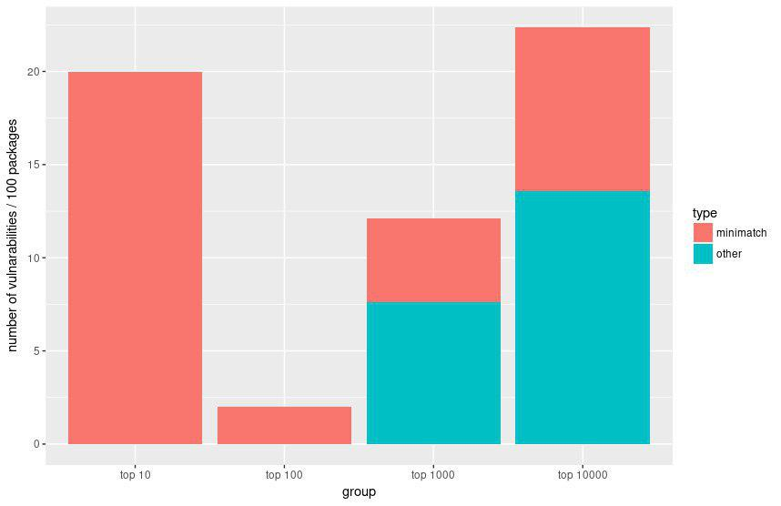

# Ergebnisse

## Dependencies

### Avg. # of dependencies

\

### Top 10 most depended on (all)

* mocha _Testing_
* chai _Testing_
* eslint _Linting_
* lodash _Extension_
* babel-preset-es2015 _Transpiling_
* gulp _Task Runner_
* babel-core _Transpiling_
* grunt _Task Runner_
* babel-cli _Transpiling_
* webpack _Task Runner_

#### Top 10 most depended on (normal)

* lodash
* request
* async
* chalk
* express
* underscore
* commander
* debug
* bluebird
* mkdirp

##### Top 10 most depended on (dev)

* mocha
* chai
* eslint
* babel-preset-es2015
* gulp
* babel-cli
* grunt
* babel-core
* istanbul
* sinon

### Top 10 most dependencies

| Name | Normal | Dev | Combined |
| --- | --- | --- | --- |
| cordova-plugin-amplify-payment | 488 | 488 | 976 | 
| cordova-plugin-amplify-pay | 488 | 488 | 976 | 
| tanngo | 267 | 267 | 534 | 
| nguye | 267 | 267 | 534 | 
| kountexample | 267 | 267 | 534 | 
| wc-starterkit | 515 | 0 | 515 | 
| primeng-custom | 500 | 14 | 514 | 
| merino | 499 | 4 | 503 | 
| xtzx | 501 | 0 | 501 | 
| big-bertha | 499 | 1 | 500 | 

__TODO: Sind bei den ersten Normal und Dev gleich, weil die dependencies die gleichen sind?__

## Downloads

### Anteil Downloads am Wochenende (Aus den Top 1000 paketen)

#### Top 10

| Name                      | Weekend |
| ---                       | ---     |
| grunt-notify              | 6%      |
| grunt-contrib-yuidoc      | 6%      |
| grunt-mocha-phantomjs     | 6%      |
| babel-istanbul            | 6%      |
| grunt-contrib-jasmine     | 6%      |
| coffeeify                 | 6%      |
| angular-mocks             | 6%      |
| dirty-chai                | 6%      |
| karma-coffee-preprocessor | 6%      |
| mocha-jsdom               | 6%      |

#### Bottom 10

| Name                      | Weekend |
| ---                       | ---     |
| ape-formatting            | 25%     |
| coz                       | 25%     |
| ape-updating              | 27%     |
| must                      | 27%     |
| ape-releasing             | 27%     |
| ape-reporting             | 27%     |
| ape-testing               | 28%     |
| testling                  | 29%     |
| emoji-100                 | 29%     |
| ape-covering              | 30%     |

__TODO: Biased, weil anhand der Dependencies gemessen, Downloads wären besser__

__TODO: Emoji-100 hat 1337 Pakete die darauf dependen => Cluster finden?__

## Lizenzen

\

__TODO: Besserer chart__

## Hoster

\

Github ist klarer Marktführer

## Vulnerabilitios

\

Trend: Je beliebter das Paket, desto geringer die Wahrscheinlichkeit,
dass es eine Vuln. besitzt => besser maintained?

Am verbreitetsten ist wahrscheinlich die Minimatch-Vuln...

## GitHub

Beliebteste commit messages

\

Personen / Bots mit den meisten Commits

\
